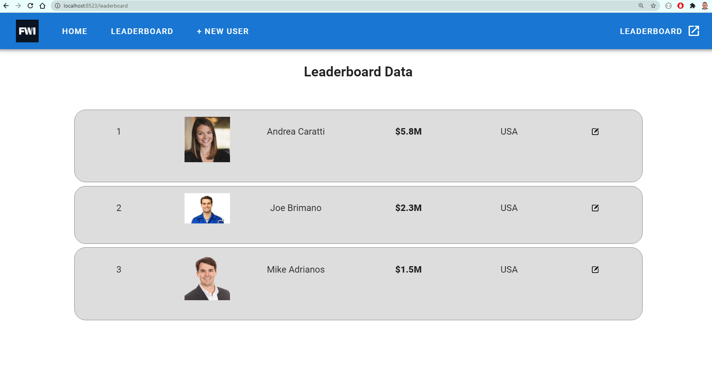

# four-winds

## Contents

- [four-winds](#four-winds)
  - [Contents](#contents)
  - [Assignment](#assignment)
  - [Back End](#back-end)
  - [API Front End](#api-front-end)
  - [Running the API front end](#running-the-api-front-end)

## Assignment

Assignment was to create an application mirroring a Microsoft Word document sent which displays a gaming leaderboard.

Task was to recreate the design and functionality to view and add users.

## Back End

The back end has been created in .NET Core using Visual Studio.

The database has been set up to automatically delete and recreate every time the application is started, so this can be altered in `Startup.cs` if desired.

```cs
public void Configure(IApplicationBuilder app, IWebHostEnvironment env, GameDbContext db)
{
    db.Database.EnsureDeleted();
    db.Database.EnsureCreated();
}
```

Images have been stored as a URL to a publicly-facing image anywhere on the internet.

The back end API should start and be fully functional simply by loading and running the application in Visual Studio 2019.

The URL exposed is `https://localhost:44389/api/Users`

<p align="center">


</p>

I have enabled `CORS` as requested so that authentication was not an issue

```cs
services.AddCors(options =>
{
    options.AddDefaultPolicy(
        builder =>
        {
            builder.AllowAnyOrigin().AllowAnyMethod().AllowAnyHeader();
        });
});
```

```cs
app.UseCors(options => options.AllowAnyOrigin().AllowAnyMethod().AllowAnyHeader());
```

The model I have created very simply as `User`

```cs
public class User
{
    public int UserId { get; set; }
    public string Username { get; set; }
    public string Thumbnail { get; set; }
    public string FirstName { get; set; }
    public string LastName { get; set; }
    public double Winnings { get; set; }
    public string Country { get; set; }
}
```

and the `DbContext` file creates the database.

## API Front End

I chose VueJS for this application as I prefer it over React and have used it more.  However I don't work with it day to day so found this side a bit more time consuming.  The C# API I created and rattled up in no time at all, but this one took a while.

I chose also to add in Vuetify which bases the styling on Google's Material Design

I also tried to avoid using anything which other people had created, and tried to build as honestly from scratch as was possible.

So, apart from the obvious VueJS templating I have really tried to build absolutely everything here absolutely from scratch, just so you can see my raw coding ability and output.

I did get stuck on working with the Material Design as I've worked with Bootstrap and also BulmaCSS before so this was a new one for me with Material Design, but I thought it was worth the try.

So that took me a bit longer than planned as it was first time using that, but I enjoyed it in the end.

I got

a) Reading data from API using `axios` all working OK

b) Sorting the leaderboard by winnings in descending order

*Note - just for speed and simplicity I added in the winnings in million pounds and also the resultant order ie top, second, third etc - I added these values actually into the user object array for ease of parsing and display but I wouldn't do that on a production large array*

c) Got the images working for the user profile 

d) Adding a new user with all fields working OK including an image URL and winnings in whole dollar amounts.   Winnings have been entered in dollars and converted to millions of dollars on the interface eg 1,230,000 is shown as $1.2M on the screen

I ran out of time for

a) Editing a user

b) Getting the country flag to display

and just working on fine tuning the styling to make it more closely match the desired image given eg shades of grey etc.

Overall I really enjoyed the project.

Thank you

Phil

:)

## Running the API front end

To run the API front end code please first run the API back-end in Visual Studio.  This should expose the data at the fixed URL given.  CORS is not an issue.

Once the back end is running, navigate to the root folder of the VueJS application [here](front-end-application) and from the command line type

```js
yarn install
yarn serve
```

<p align="center">

</p>


<p align="center">

</p>


The application with all of the libraries should download, install and then the application should run.

The home page is blank so just navigate to the leaderboard and add new users page.

<p align="center">


</p>
